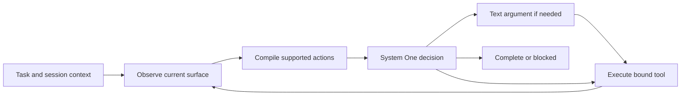

# Agent harness design for decision models

Research and local experiments: 2026-09-25.

## Online sources and their scope

| Primary source                                                                                                              | Finding                                                                                                                   | Application here                                                                                                                                    |
| --------------------------------------------------------------------------------------------------------------------------- | ------------------------------------------------------------------------------------------------------------------------- | --------------------------------------------------------------------------------------------------------------------------------------------------- |
| [Anthropic: Building effective agents](https://www.anthropic.com/engineering/building-effective-agents)                     | Keep the loop simple and use tool results as feedback. Added structure needs measured benefit.                            | Keep one decision-model controller and typed drivers.                                                                                               |
| [Anthropic: Writing effective tools](https://www.anthropic.com/engineering/writing-tools-for-agents)                        | Clear tool boundaries, useful return values, and trace review matter. More tools can confuse the model.                   | Offer observed capabilities, distinguish attempts from results, and record candidate choices.                                                       |
| [Anthropic: Context engineering](https://www.anthropic.com/engineering/effective-context-engineering-for-ai-agents)         | Context must be selected and bounded.                                                                                     | Keep current observations separate from historical session context; keep recent action/result pairs together.                                       |
| [Anthropic: Effective harnesses](https://www.anthropic.com/engineering/effective-harnesses-for-long-running-agents)         | Persistent progress and real tests prevent false completion across sessions.                                              | Preserve session references, but rebind the current request and verify current results. A coding-agent initializer/planner is not required here.    |
| [Anthropic: Agent evaluations](https://www.anthropic.com/engineering/demystifying-evals-for-ai-agents)                      | Grade outcomes and traces; model judgments and deterministic checks have different limits.                                | Separate provider-response tests, real-model decision checks, driver integration, and actual task outcomes.                                         |
| [CLM model card](https://huggingface.co/Contrastive-LM/CLM-v0.1-8B) and [API/source](https://github.com/Contrastive-LM/CLM) | CLM scores supplied candidates; scores are relative to that set. State and candidate embeddings can be cached separately. | Keep labels stable and meaningful. Do not interpret a score as calibrated task-success probability. No generated plan or vision ability is assumed. |
| [Browser Use: jev-ultrafast](https://github.com/browser-use/jev-ultrafast)                                                  | Operation and compatible targets are scored together; text is generated only for a selected typing operation.             | This matches the controller/text-helper split. Joint questions require CLM-specific tests before adoption.                                          |
| [SystemOneHarness](https://github.com/HarnessRouter/SystemOneHarness)                                                       | Finite action compilation, bounded context, and complete transition traces.                                               | Preserve explicit available actions and their distributions. Its risk thresholds are not calibration data for our CLM.                              |
| [jev-use](https://github.com/shitianfang/jev-use)                                                                           | Typed escalation to an LLM handles uncertain decisions.                                                                   | Useful error categories; its LLM takeover does not match our design.                                                                                |
| [BrowserGym](https://github.com/ServiceNow/BrowserGym)                                                                      | Common browser environments support repeatable agent evaluation.                                                          | A reference for task fixtures and outcome graders; browser evaluation alone cannot prove native macOS reliability.                                  |

## Loop to keep

The same controller works through browser and native drivers. The model can change tool sets. The harness does not route requests by app-name keywords or encode a per-site sequence. Session reuse preserves context and target references; it does not authorize an old target to receive a new task's actions.

A text helper may supply a URL, installed application name, or field value for an already-selected tool. It does not choose the next tool, produce a task plan, or take over after a failure.

## Changes retained from this investigation

1. Completion checks always see observed content, URL, and available task context. The previous display-only classification removed content and omitted context. It could call a follow-up complete without the requested document being selected.
2. The completion question names the current task. The binary model choice controls completion; the unsupported extra 0.6 cutoff was removed. This does not make the model a reliable or calibrated verifier.
3. The next-action state includes the current URL.
4. Recent history pairs each action with its return status and result. A successful call means it returned, not that the overall task succeeded.
5. Local traces include the exact candidate array for next-action distributions. `A0` maps to candidate zero; the selected action may differ after verification. Binary completion and verification distributions remain separate.
6. A repeatable, side-effect-free real-model evaluation is available with `bun run eval:decisions`. It only scores fixed observations and never executes desktop or browser actions. A failure returns a nonzero exit code.

## Experiments and limits

The initial attempt to ask completion and next action together over one shared state regressed completion on already-open content. It was rejected. The CLM engine appends each question's instructions to the state before encoding it: one HTTP request is not necessarily one encoder pass. Joint operation/target questions remain an experiment, not a default.

On 14 fixed development observations, the previous implementation made 12 correct complete/continue decisions; the retained changes made 13. Total HTTP calls were 35 before and 22 after. This includes removal of the display-only classification and short-circuiting when complete. Exact-state embedding caches were warm during repeated runs, so these timings are not a speed benchmark.

The remaining failure is a follow-up, "Open it again", with the wrong document open. CLM still marked it complete. This suite is small, synthetic, and used during development. **13/14 is not general task accuracy, a held-out estimate, or a completion guarantee.** Several unfinished cases also selected a weak next action such as Tab; the complete/continue grade does not judge that action's usefulness.

No app-specific workflow was added. The 0.8 click-verification gate predates this investigation and remains an uncalibrated heuristic. Native capability coverage remains incomplete, especially drag, scroll, canvas and vision-driven tasks. These are constraints on the product, not proof that a different orchestration framework will solve them.

## Next acceptance gate

Use independently graded, multi-step tasks across browser and native apps, including changed-app follow-ups, duplicate creation, absent controls, delayed state updates, and switching tool sets after an error. Check the saved result outside the model's own DONE judgment. Report task success, false completion, duplicate side effects, median decision latency, and total task time separately. Do not tune on the held-out tasks.

## Subsequent live-test update

The research-only changes above were tested on real browser tasks later that
evening. Several initially failed. The current implementation and measured task
results are recorded in [validation](../validation.md#extended-real-model-testing-september-25-2026-evening).
In particular, operation/target selection is now separate, successful tool prose
is not fed back as completion evidence, target mismatches constrain editing, and
the 0.6 completion gate was restored after an observed false-positive. Read that
section for the retained design; the experiment counts above are historical.
